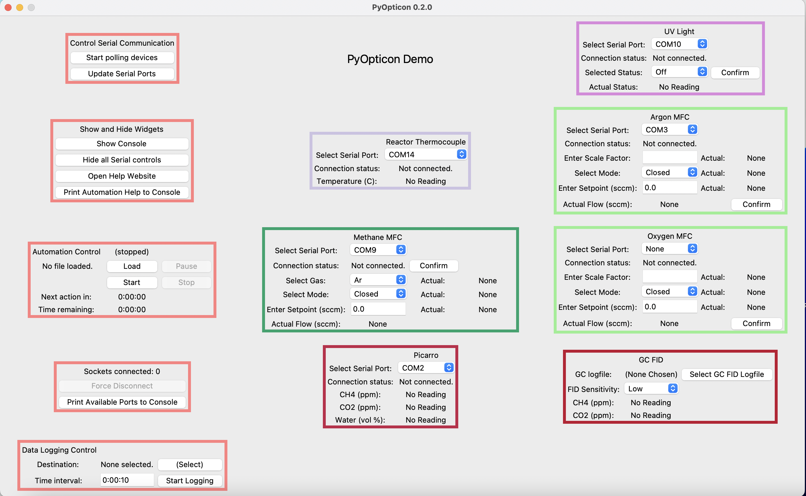

Tutorial: Using an Existing Dashboard
=====================================

This tutorial talks about how PyOpticon dashboards are laid out and how one uses their basic functions. 
Most folks will want to start with the built-in 'demo dashboard,' which the next section tells you how to open. 
If someone else has already built a dashboard that connects to real instruments in your facility, you can 
also learn on that. You can mostly operate a dashboard without knowing Python, though a little bit of coding is required to 
write automation scripts.

Getting Started with the Demo Dashboard
***************************************
 
If you don't have an existing dashboard that someone else in your lab built, 
you can open the built-in 'demo' dashboard by entering the code below in IDLE or another Python shell. Note that this dashboard 
uses 'serial emulators', which are basically imaginary instruments, to let you get a sense of how 
PyOpticon dashboards work without being plugged into lots of physical devices. It works just 
fine on a laptop.

.. code-block:: python

    import pyopticon.demo_dashboard as dd
    dd.run_demo_dashboard()

You'll get a dashboard that looks like this:

It's possible that the Dashboard will get cut off at the bottom of your screen. If so, you'll need to mess with 
the y pad between widgets and/or scale the widgets down, which the next tutorial page explains.

We'll just quickly run through some of the dashboard's features. The four red widgets on the left-hand side 
control most of the top-level functions:

1. The first widget has a 'start/stop polling' button. When polling is started, the dashboard begins querying every 
physical device for its state every so often (usually 1 second), then reports the devices' responses in their 
respective widgets. While serial polling is active, it's also possible to send commands to the devices, either 
by manually entering parameters and hitting a widget's confirm button, or by doing the same thing with an automation script. 

The 'update serial ports' button updates every widget's dropdown menu of available serial ports, which is useful if 
serial ports have changed (e.g. a new device was plugged in) since the dashboard was launched.

2. The second widget is mostly for showing and hiding different interface elements. On a PC, the console is hidden by default, 
and the 'show/hide console' button toggles its visibility. It's helpful to see the console because that's where error 
messages, help info, and other updates are printed. On a Mac, one can't toggle the console with a button, so the 
dashboard has to be run from some kind of Python shell (e.g., IDLE or terminal) or configured to launch from the 
Python Launcher with a terminal window. 

The next button shows or hides the serial port interface on every widget, 
which can de-clutter the screen once the serial connections are established. The next button links to this website. 
The final button prints a list of widgets' nicknames and fields, as described in the 'Writing Automation Scripts' 
section of this page.

3. The third widget is for loading and running automation scripts, which are written in Python using PyOpticon-specific
methods to schedule certain types of actions. Automation scripts are good for automating many types of experiments, including 
repeating subprocesses multiple times and awaiting a condition to proceed. Scripts can be paused and resumed, and the 
widget displays progress through the script as it executes. See the 'Loading PyOpticon Automation Scripts' section 
below for information on how to do this.

4. The fourth widget is for allowing external Python scripts to connect to the dashboard via a socket. Other Python 
programs can load an object representing the connection to the dashboard, which can be queried for values or sent 
commands. These kinds of scripts can let you integrate Dashboards into complex operations involving Python control 
structures. For instance, you could use 'if' statements to change the experimental plan mid-run based on live measurements,
apply a control law to a certain input based on a certain measurement, or generate a live-plot of a certain measurement.
See the 'Connecting via Sockets' section below for more information.

5. The fifth widget is for data logging. To log data, click the button to select a destination address, then 
click 'start logging'. By default, 
the logfile's name is the current date and time. Data are always logged to a .csv file whose format is described 
below. If you choose to log data to an existing file, new lines are appended to the file, which works well if 
the file is an existing logfile from the same dashboard, but will be unreadable otherwise (since new headers for 
the columns won't be added). You can also choose the data logging interval in h:mm:ss format.

The other widgets represent different devices. Each widget has a name, which is displayed on its top, as well as 
a nickname, which is used to identify it in data logs and automation scripts. Any widget with a serial connection 
has a dropdown menu to select which serial port it should connect through. Once polling starts, the dashboard will 
poll the device's state on a regular basis, displaying the updated values in the widget. Some widgets also have user 
input fields and a 'confirm' button. Changing the fields does nothing until that widget's 'confirm' button is pressed, 
at which point the widget sends commands to the device containing the input fields' latest values. It's normal for some 
widgets' fields to say 'read error' the polling cycle after 'confirm' is pressed. The Spice-O-Meter 
exists as a simple demonstration of some options for building widgets; unlike the others, it doesn't actually correspond to a 
physical device.

You can start playing with these functions in the demo dashboard. A good place to begin would be to start polling serial devices 
and see how readings from imaginary devices appear in the widgets. Check out the console. 
If you click 'confirm' on some devices, a message will print to the console. You can also try logging data or 
use the instructions below to try out a basic automation script.

What's going on inside a dashboard?
************************************

This section is useful for intuition, but not essential to read unless you're planning on building your own 
dashboard or writing a widget. To use a dashboard, log data, or write automation scripts, you can get by just fine without it.

A dashboard is essentially a Python object containing a variety of widgets. Both the dashboard and the widgets have 
graphical representations as well as specific roles in the process of updating the dashboard and performing all its 
functions. The dashboard contains the four 'control widgets' in the left-hand column, as well as any number of 
'device widgets' representing physical devices or other groups of functions.

Mostly, each widget minds its own business, using its own methods to respond to inputs like clicked buttons. All device widgets also 
respond to specific cues from the dashboard or its control widgets: 
for example, a thermocouple widget might be prompted by the dashboard 
to hide its serial controls, query its serial line for new data, or provide all its current loggable data. You need not worry 
about these interactions too much unless you're trying to write your own widget.

At a regular interval, usually once a second, the dashboard does all of the following:

* If serial is connected, tell each widget to query its device for its latest data
* If serial is connected, a little while after querying, tell each widget to check for a response from its device and update graphical elements accordingly.
* If data logging is active, ask each widget for all loggable data, aggregate those data, and write them to a file
* If an automation script is active, check whether it's time to execute one of more of the queued automation actions
* Run each function in a list of interlock functions, specified when the dashboard is built, to perform any safety or status checks

This is all done with a simple event-driven framework, with both the graphical interface and the event-driven functionality 
implemented in Python's built-in tkinter library. PyOpticon runs Tkinter within the asyncio framework (using the async-tkinter-mainloop library), 
which means that certain tasks can be run asynchronously, such as updating interface fields after a serial device responds. 
However, the code doesn't use multithreading, which means that when writing widgets, we must beware of any 'blocking code' that could bog down the system and potentially cause 
it to crash. More details on this are in the 'Writing Your Own Widgets' tutorial.

Processing Logged Data
**********************

You can log data using the instructions in the first section of this page. 
Data are logged to a .csv file that looks something like this:

.. image:: img/csv_format.png
    :alt: A screenshot of the csv format

The headers are of the following format: ``widget_nickname + ': ' + field_nickname``, but with all instances of 
``','`` replaced with ``' -'`` to make it compatible with the .csv format.

You can open the .csv file in Excel and manipulate it there. It's also easy to load the data into 
Python or Matlab. To manipulate the data in Python, we suggest using the Pandas package, which includes 
lots of convenient built-in tools. Two helpful tools are the one for converting text dates into Datetime objects that play 
nicely with plots, and the one for converting text into floats while specifying how to handle non-numeric values.
Here's an example of loading some temperature data and plotting it:

.. code-block:: python

    # Import Pandas
    import pandas as pd
    # Load the file into a dataframe and convert the text dates into Datetime objects
    data = pd.read_csv('/Users/work/Desktop/09-19-23_16-26_logfile.csv',parse_dates={'Datetime':[0,1]})
    # Turn the temperature data into float's, turning any values like 'No Reading' into NaN
    data['Reactor TC: Temperature'] = pd.to_numeric(data['Reactor TC: Temperature'],errors='coerce')

    # Make a quick plot, just for demo's sake. The Datetime objects work well for plot x axes.
    import matplotlib.pyplot as plt
    plt.plot(data['Datetime'],data['Reactor TC: Temperature'])
    plt.show()

The plot's not shown to save space, but it looks much like the one in the 'Live Plotter' section at the bottom of this page.

Writing and Loading PyOpticon Automation Scripts
****************************************************

Automation scripts are standalone Python scripts (.py files) that are run by a dashboard. 
The scripts are run using Python's ``exec`` function immediately after the 'Load' dialog is finished. 
Since ``exec`` is not at all secure, don't run any scripts from sources you don't trust. The script is run in 
a namespace with several convenient automation functions already defined:

* ``schedule_function(function)``
* ``schedule_action(widget_nickname, field_name, new_value, confirm=True)``
* ``schedule_delay(duration)``
* ``schedule_await_condition(condition, console_summary='(No summary provided)')``

``schedule_function`` executes an arbitrary function that you pass. ``schedule_action`` changes a field in a PyOpticon 
widget (provided it's a subclass of GenericWidget) and optionally executes the confirm function, 
emulating a human adjusting an input field and clicking the confirm button. 
``schedule_delay`` schedules a wait, much like ``time.sleep``, except that the wait occurs once the automation script is started, 
not when it's loaded. ``schedule_await_condition`` causes the script to wait until a certain condition is satisfied. 
Here is a simple script demonstrating these functions:

.. code-block:: python

    # This is a demonstration of an automation script
    schedule_function(lambda: print("Starting Script!"))
    schedule_delay('0:00:05') # Time is passed in h:mm:ss format
    schedule_function(lambda: print("Turning on light."))
    schedule_action('UV Light','Status Selection','On')
    # This widget is an ultraviolet light controlled by an IoT Relay Widget
    schedule_delay('0:00:15') # Wait 15 seconds
    schedule_function(lambda: print("Turning off light."))
    schedule_action('UV Light','Status Selection','Off')
    # Now, define a condition to check, and wait til it's fulfilled to print something
    def check_temp(dashboard):
        if float(dashboard.widgets_by_nickname['Reactor TC'].get_field('Temperature'))>33:
            return True
        else:
            return False
    schedule_await_condition(check_temp, 'Reactor Temp > 33C')
    schedule_function(lambda: print("Temperature has exceeded 33C"))

Note that using ``schedule_action`` requires that you know a widget's nickname and the name of the field you want to change. 
If you're not sure, click the "automation help" button in the GUI, and a list of all the widgets' nicknames and fields 
will be printed to the console. The option ``confirm=False`` is meant for when you need to change multiple fields before 
confirming and sending a command to the device. Here's an example of changing both the mode and setpoint on a mass flow controller:

.. code-block:: python

    schedule_action('Methane MFC','Mode Entry','Setpoint',confirm=False)
    #Confirm defaults to True
    schedule_action('Methane MFC','Setpoint Entry','30',confirm=True)
    #30 is the flow rate setpoint in cc's per minute

When using ``schedule_function`` to execute an arbitrary function, you might want that function to have access to the dashboard object 
or its widgets. The function passed to ``schedule_function`` can take 0 or 1 arguments, and if it takes 1 argument, it will be 
passed the dashboard object. Here's an example of scheduling a function that accesses properties of the dashboard and widgets:

.. code-block:: python

    # This just prints a certain field to the console after an hour -- 
    # bit of a silly example since that's what data logging is for
    schedule_delay('1:00:00')
    schedule_function(
        lambda dashboard: print(dashboard.widgets_by_nickname['Spice'].get_field('Spiciness')))

Since automation scripts are written in Python, we can also use control structures like functions and for-loops to 
avoid repeating ourselves. This is handy for running the same experiment, or variants thereof, many times:

.. code-block:: python

    # Define a function combining some calculations and action scheduling
    # MFC stands for Mass Flow Controller
    def schedule_flow_percent_oxygen(total_flow, what_percent_oxygen):
        oxygen_setpoint = 0.01*what_percent_oxygen*total_flow
        argon_setpoint = total_flow-oxygen_setpoint
        schedule_action('Oxygen MFC','Setpoint Entry',str(oxygen_setpoint),confirm=True)
        schedule_action('Argon MFC','Setpoint Entry',str(argon_setpoint),confirm=True)

    # Set up the initial state
    total_flow = 30 #cc's per minute
    schedule_action('Oxygen MFC','Mode Entry','Setpoint',confirm=True)
    schedule_action('Argon MFC','Mode Entry','Setpoint',confirm=True)
    schedule_delay('0:00:10')

    # Step through several flow conditions and hold each for 10 minutes
    for oxygen_percentage in (0,20,40,60,80,100):
        schedule_flow_percent_oxygen(total_flow,oxygen_percentage)
        schedule_delay('0:10:00')

    # Return to a safe state afterwards
    schedule_action('Oxygen MFC','Mode Entry','Closed',confirm=True)
    schedule_action('Argon MFC','Mode Entry','Closed',confirm=True)

Remember that the whole automation script is executed right when it's loaded, so any conditional logic (e.g., 
'at this point in time, if this temperature is above that value, do this') needs to be within a function that's 
passed to ``schedule_function``, not freestanding code within the script, as here:

.. code-block:: python

    # DO NOT do this:
    schedule_delay('1:00:00')
    try:
        if float(dashboard.widgets_by_nickname['Reactor TC'].get_field('Temperature'))>900:
            schedule_function(lambda: print("Time to panic!"))
            # The if statement is evaluated when the script is loaded, not an hour after the script starts!!
    except ValueError:
        pass #Thrown if the temperature is 'None' or 'Read Error'

    # Instead, do this:
    def check_for_panic(dashboard): #Define a function containing the logic needed
        try:
            if float(dashboard.widgets_by_nickname['Reactor TC'].get_field('Temperature'))>900:
                print("Time to panic!")
        except ValueError:
            pass #Thrown if the temperature is 'None' or 'Read Error'

    #Schedule a call to that function at the appropriate time
    schedule_delay('1:00:00')
    schedule_function(check_for_panic)

Finally, we can use ``schedule_await_condition`` to wait until a certain condition is satisfied to proceed. A 'skip' button 
also shows up in the widget while the script is waiting. The 'condition' is a function that takes the Dashboard object as 
an argument and returns a boolean (True or False) with whether the condition has been satisfied; see some examples below. 
Remember that the 'Automation Help' button will remind you of the names and fields of your various widgets. An await step 
is stored internally as a 1-second delay that is renewed every the time the condition isn't met, so your 'time remaining' 
counter may be a couple of seconds off for scripts that use this function. The ≥ symbol in the time remaining means that one 
or more future steps is an awaiting step.

.. code-block:: python

    # Define a condition to check, and wait til it's fulfilled to print something
    def check_temp(dashboard):
        if float(dashboard.widgets_by_nickname['Reactor TC'].get_field('Temperature'))>33:
            return True
        else:
            return False
    schedule_await_condition(check_temp, 'Reactor Temp > 33C')
    schedule_function(lambda: print("Temperature has exceeded 33C"))

Alternatively, we can do the same thing in a one-liner with a lambda function:

.. code-block:: python

    # Define a condition to check, and wait til it's fulfilled to print something
    schedule_await_condition((lambda d: float(d.widgets_by_nickname['Reactor TC'].get_field('Temperature'))>33), 'Reactor Temp > 33C')
    schedule_function(lambda: print("Temperature has exceeded 33C"))

Connecting via Sockets
****************************************************

Sockets allow an external Python script to query values from or send commands to an active Dashboard. 
They allow you to use more complex control structures than a PyOpticon automation script, e.g. 'if' statements. 
However, you give up the ability to see progress in the script's execution. We'd recommend using automation 
scripts to automate experiments if possible, and then using sockets if you run up against their limitations. Sockets can 
also be used to make a standalone live-plotting program for data from the dashboard. 

The socket connection to a dashboard is initialized and used like so:

.. code-block:: python

    from pyopticon.socket_client import PyOpticonSocketClient

    s = PyOpticonSocketClient()
    print(s.get_field("UV Light","Actual Status"))
    s.close()

The socket client takes two optional arguments. ``socket_number`` defaults to 12345 but can be set to anything. You can 
double-check socket(s) a Dashboard has available using the button on the socket widget -- by default, it's just 12345, but 
whoever wrote the dashboard can configure whatever list of port numbers they want. ``handle_errors`` defaults to 'none'; its 
options are 'none' which prints nothing when the Dashboard reports an error in executing a socket command, 'print' which 
prints a message but lets the script keep running, and 'exception' which raises an exception when the socket reports an error.

It's best practice to close the socket when you're done with it, though if you forget and the socket is 'left hanging', 
nothing terrible should happen. You can also forcibly disconnect the socket using a button on the widget, which will 
cause the client to eventually report a 'broken pipe' or 'connection reset by peer'.

The socket client object has the following methods:

* ``get_field(widget_nickname, field_name)``: Returns the current value of a field in a certain widget.
* ``set_field(widget_nickname, field_name, new_value)``: Sets the value of a field, but does not execute Confirm afterwards.
* ``do_confirm(widget_nickname)``: Executes a certain widget's confirm function as though the confirm button had been pressed.
* ``do_eval(expression)``: Evaluates an expression as described below and returns the result.
* ``do_exec(expression)``: Executes a block of code as described below.

All of the above have the optional ``printout`` argument, defaulting to False, that confirms to console when a command was successfully 
executed.

One should use ``do_eval`` and especially ``do_exec`` with great caution, as they have the potential to cause a lot of 
trouble, but we include them to ensure that anything you can do from within a Dashboard can also (in principle) be done 
through a socket. Each of them executes the provided string as Python code in a namespace containing the functions 
``get_dashboard()``, which returns the Dashboard object, and ``do_threadsafe(function)``, which should be used for any calls 
that modify Dashboard, widget, or GUI objects (since socket commands are processed in a different thread from the 
GUI main thread, and most Tkinter objects are not threadsafe). Also, note that due to the use of the ``inspect`` package, 
you must separately define a function before passing it to ``do_exec``:

.. code-block:: python

    from pyopticon.socket_client import PyOpticonSocketClient
    s = PyOpticonSocketClient()

    # DO THIS
    l = lambda: print(":)")
    s.do_exec(l)
    
    # NOT THIS
    s.do_exec(lambda: print(":("))

    s.close()

Here's an example of a demo automation script, compatible with the demo dashboard, that uses some more of these methods:

.. code-block:: python

    from pyopticon.socket_client import PyOpticonSocketClient
    import time

    # Define some functions to try with exec
    def test_fn():
        d = get_dashboard()
        v = d.get_field("UV Light","Actual Status")
        do_threadsafe(lambda: print("Light is "+v+"!!!!!"))

    l = lambda: print("Hello :D")

    # Initialize the socket client
    s = PyOpticonSocketClient(handle_errors='exception')

    # Do some field gets, sets, and confirms
    print(s.get_field("UV Light","Actual Status"))
    print(s.set_field("UV Light","Status Selection","On"))
    print(s.do_confirm("UV Light"))

    time.sleep(10)

    # Do an eval
    print(s.do_eval("str(get_dashboard().serial_connected)"))

    # So some exec's
    print(s.do_exec(test_fn))
    print(s.do_exec(l))

    # Close the dashboard
    s.close()

Common Issues
*************

Q: How do I see errors? 

A: Click the 'show console' button on a PC; or, if you're on a mac, follow the instructions higher on this page.

Q: Why is my device failing to connect?

A: The most likely issue is that another program is already communicating with it -- programs can't share serial ports. 
Close the other program, or if you can't tell which program is the issue, restarting your computer usually fixes it. 
Also check all the wiring and swap out extender/converter cables in case one is faulty.

Q: I changed the cable setup (or suspect that the serial ports got reassigned) and now I don't know what my device's 
serial port is. How do I find it?

A: Refer to the "miscellaneous useful features" tutorial and follow the procedure to use the PyOpticon com port scanner tool.