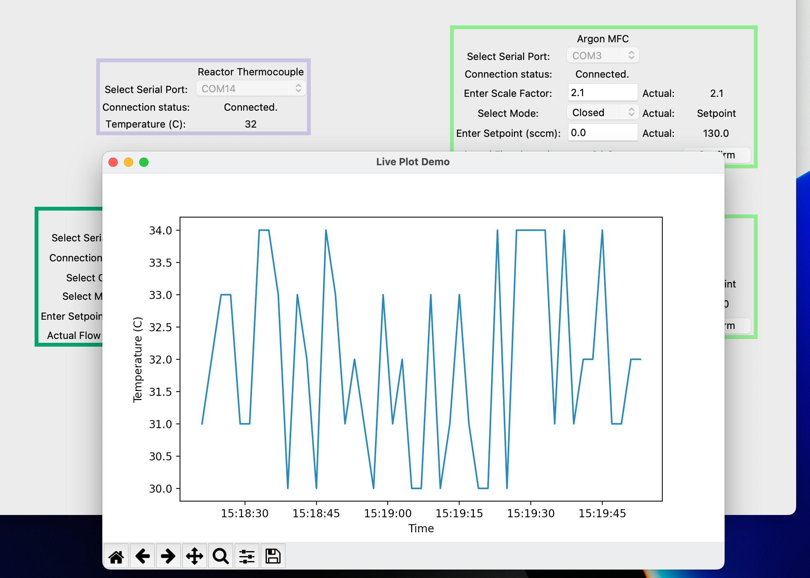

Tutorial: Miscellaneous Useful Features
=======================================

These are some features that didn't fit elsewhere in the tutorial but may be handy.

The GmailHelper Class
**************************

It may be useful to receive notifications from your system, e.g. when an interlock is tripped or when an automation protocol 
finishes. There are many online sources on how to send emails and texts from Python scripts, but we've packaged a simple 
built-in tool for sending emails through Gmail, which can also be used to send text messages using cell providers' SMS gateways.

To use this, either use a personal gmail account or create one for this purpose alone (recommended if multiple people use 
this dashboard). Follow online instructions to get an 'app password,' which is different from the password that you use 
to log in. Normally this app password will just be a bunch of random numbers and letters. 

Once you've initialized a ``GmailHelper`` object, you can use it to send emails. 
You can also send text messages by sending an email to 
the correct cell provider's SMS gateway, which forwards emails to phones as text messages. 
The example below initializes a ``GmailHelper`` that sends emails to an account and text messages to 
somebody's phone, then sends it a message:

.. code-block:: python

    # Initialize the helper
    from pyopticon.utilities.gmail_helper import GmailHelper
    gh = GmailHelper(gmail_address="fake_address@gmail.com",auth_string="app_password",
        destination_emails=['person_1@hotmail.com','12345678910@vtext.com'])
        #Assume 1-234-567-8910 is a cell number on Verizon
    
    # Send a message through it
    # Normally, this would be done in an interlock function, or similar.
    gh.send_email(subject="PyOpticon Alert",
        message_body="The velociraptors have escaped!")

The Serial Port Finder Function
********************************

Sometimes it's hard to figure out which serial port corresponds to which physical cable or device. It's especially frustrating 
when a USB multiplexer gets moved or changed and the serial ports for many devices are scrambled. We've included a tool to help 
with this, which is invoked as follows from a Python shell:

.. code-block:: python

    from pyopticon.utilities.serial_port_scanner import scan_serial_ports
    scan_serial_ports()

This program enters an infinite loop in which anytime a serial port disappears or reappears, its name 
is printed to the console. So, you might unplug the cable that runs to a thermocouple adapter, and this 
tool will reveal that 'COM6' was the one that disappeared. This tool is handy for figuring 
out each device's serial port, and so each widget's default serial port, when constructing a dashboard.

Live Plotters for Logged Data
******************************

Often, it's convenient to create live plotters to visualize instruments' measurements over time. To avoid bloating the 
PyOpticon API and UI, we suggest creating live plotters as standalone apps that watch a PyOpticon logfile and plot its 
contents every few seconds.
You can load and parse the logfile with the Pandas library's ``read_csv`` function, as in the 'Processing Logged Data' section 
above.

We recommend writing something like the following script in a .pyw file and giving it its own 
desktop shortcut according to the process described elsewhere in the tutorial. Then, you can launch the live plotter as 
soon as you start logging data for a given experiment.

.. code-block:: python

   # Imports
    import matplotlib.pyplot as plt
    import matplotlib.animation as ani
    from tkinter import filedialog as fd
    import pandas as pd

    # Get the logfile name
    logfile_path = fd.askopenfilename(title="Choose PyOpticon Logfile Location")

    # Launch the plotting window
    fig,ax=plt.subplots()

    # Define how to update it every few seconds
    def animate(useless_argument): #useless_argument is required for some reason
        # Load the csv using Pandas, casting the text dates into datetime objects suitable for plotting
        data = pd.read_csv('/Users/work/Desktop/09-19-23_16-26_logfile.csv',parse_dates={'Datetime':[0,1]})
        # Turn the temperature data into float's, turning any values like 'No Reading' into NaN
        data['Reactor TC: Temperature'] = pd.to_numeric(data['Reactor TC: Temperature'],errors='coerce')
        ax.clear()
        ax.plot(data['Datetime'],data['Reactor TC: Temperature'])
        fig.canvas.set_window_title('Live Plot Demo')
        ax.set_xlabel('Time')
        ax.set_ylabel('Temperature (C)')

    # Update the plot, and then keep doing so every 5 seconds
    animate(None)
    a = ani.FuncAnimation(fig, animate, interval=5000)
    plt.show()

Here's what this window looks like when run with random temperatures from the demo dashboard in offline mode:

Of course, you can make more complex live plotters with multiple lines, multiple subplots, etc. You could also make 
a live plotter using the socket connection function that doesn't require a logfile, but rather reads live values 
directly from the dashboard.
